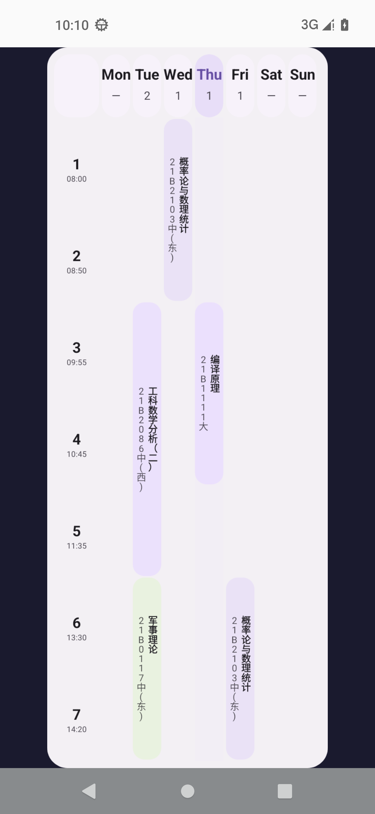
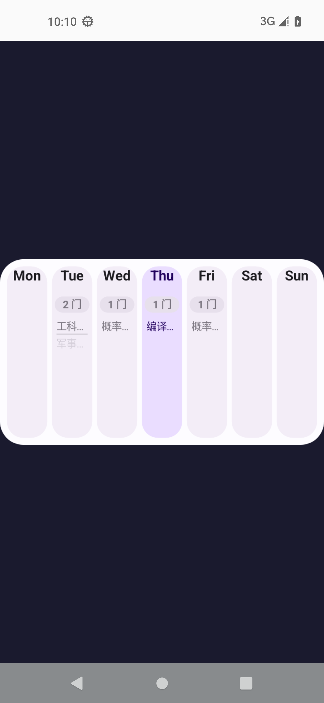
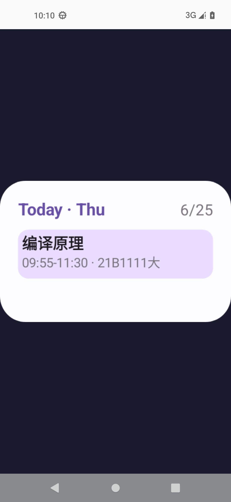
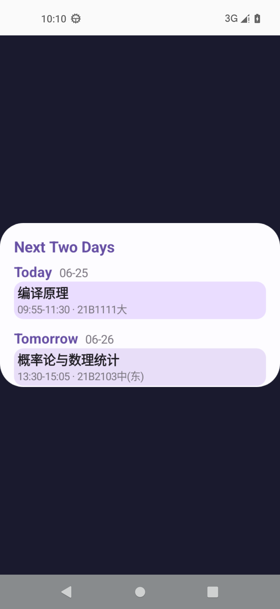
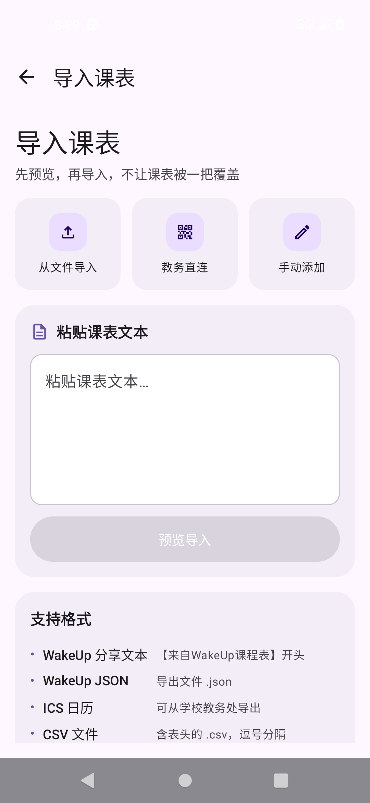

# Sleepy · 轻课表

> Android 课程表 App · 纯 Kotlin + Compose · GPL-3.0

[→ 中文](README.md) · [→ English](README.en.md)

---

## 截图一览

<p align="center">
  
  
  
</p>
<p align="center">
  
  
  
  
</p>

<p align="center">
  <code>v1.0.19</code> · Android 7.0+ · 包名 <code>com.lingion.sleepy.debug</code>
</p>

---

## 概要

| 项 | 值 |
|---|---|
| 包名 | `com.lingion.sleepy.debug` |
| 最低 SDK | 24 (Android 7.0) |
| 目标 SDK | 35 |
| 架构 | arm64-v8a / x86_64 |
| 语言 | zh-CN · zh-TW · en · ja · es |

Sleepy 乃 Android 课程表工具。主旨：**轻、快、准**。零壳依赖，支持教务直连导入、多格式解析、四类桌面 Widget、每日课程通知、深色模式，五种主题配色任选。

---

## 🖥 三视图

课表主页内置三种视图，顶部一键切换。

| 视图 | 截图 |
|---|---|
| **周视图**（7 日横排 × N 节） | <p align="left"></p> |
| **网格视图**（时间网格 · 课程色块） | <p align="left"></p> |
| **今日视图**（底部"今日"Tab · 当日课程） | <p align="left"></p> |

特性：
- 左/右滑周切换器，实时算周次
- **v1.0.19：手指左右滑动切换周次**（HorizontalPager），周视图与网格视图均支持
- 课程按"起止周+单双周+起止节"自动过滤当前周
- 点击课程卡片弹出详情底部弹窗

---

## 📚 多课表管理

可同时管理多张独立课表，每张表拥有自己的节次时间表、开学日期、最大周数。

<p align="left">
  
  
</p>

> 左：所有课表列表（齿轮进入编辑）
> 右：我的页面（统计 + 入口）

新建/编辑课表必填项：名称、开始日期、最大周数、节次时间表（手动或自动模式）。

---

## ⏰ 节次配置（手动 / 自动双模式）

v1.0.16 引入智能节次编辑器。手动模式逐节设起止；自动模式输入每节时长 + 总节数 + 首节时间 + 课间模板，自动推算全部时间。

<p align="left">
  
  
</p>

> 左：手动模式（展开的 12 节 HEU 真实节次）
> 右：自动模式（每节时长 / 总节数 / 首节 / 大小课间模板 / 预览切换）

自动模式特性：
- 跨组互斥（同一 transition 不能同时属大/小课间）
- 默认 0 分钟连续，无间隔亦合法
- 卡片网格多选，点击直观反馈

---

## 🎓 教务系统导入

WebView 登录 → 自动抓取课表。

| 协议 | 说明 |
|---|---|
| `wisedu` | 金智教务（JSON API 直连，如哈尔滨工程大学） |
| `qz` / `qz_old` / `qz_crazy` / `qz_br` / `qz_with_node` | 强智教务（5 变体） |
| `zf` / `zf_1` / `zf_new` | 正方教务（3 变体） |
| `urp` / `urp_new` | URP 教务（2 变体） |
| `cf` | 青果教务 |
| `pku` | 北京大学 |
| `bnuz` | 北师珠 |

<p align="left">
  
</p>

导入流程：选来源 → 教务 WebView 登录 → 自动解析 HTML → 写入课表。

> v1.0.18：导入课表改为 ModalBottomSheet 弹窗，操作更流畅。

---

## ✏️ 课程编辑

<p align="left">
  
  
</p>

> 左：手动添加/编辑单条课程
> 右：点击周视图课程卡片弹出详情底部弹窗

字段：课名 · 教师 · 教室 · 备注 · 星期 · 起止节 · 起止周 · 单双周类型 · 课程色。

---

## 📥 导入入口

<p align="left">
  
  
</p>

> 左：导入页（粘贴文本 + 4 种格式自动识别）
> 右：教务直连 → 选学校 → WebView 登录 → 抓取

---

## 📤 导出课表

v1.0.16 新增完整导出功能。三种格式可选，导出文件自动保存到设备 `Download/Sleepy/` 并触发系统分享面板。

<p align="left">
  
</p>

> 截图：导出页（在"我的 → 导出课表"）

三种导出格式：

| 格式 | 用途 | 实现 |
|---|---|---|
| **WakeUp 兼容 JSON** | 完整课表结构，可被 WakeUp 课表等同类 App 直接导入 | `ScheduleExporter.exportWakeUpJson` |
| **分享文本** | 短文本格式（URL 编码 JSON），可粘贴到任何聊天工具 | `ScheduleExporter.exportWakeUpShareText` |
| **ICS 日历** | 标准 iCalendar 格式，可导入系统日历 / Google / Apple Calendar | `ScheduleExporter.exportIcs` |

文件路径：`Download/Sleepy/sleepy_<表名>_<时间戳>.{json|ics}`。

---

## 🧩 桌面 Widget（4 类）

四类 Widget，WorkManager 定时刷新。布局尺寸与各 launcher 自适应。

| Widget | 默认尺寸 | 用途 | 截图 |
|---|---|---|---|
| **Today** | 3×2 cell（180×110dp） | 今日课程，最多 3 节 | <p align="left"></p> |
| **TwoDay** | 4×2 cell（240×140dp） | 今天 + 明天 | <p align="left"></p> |
| **WeekList** | 4×2 cell（280×160dp） | 7 日课程统计 + 名称 | <p align="left"></p> |
| **WeekGrid** | 4×5 cell（250×640dp） | 完整时间网格 + 课程块 | <p align="left"></p> |

实现要点：
- Today / TwoDay / WeekList：Glance + Canvas 渲染
- WeekGrid：纯 Canvas + Bitmap（不受 Glance 11+ child 数量限制）
- 配色与 app 主题实时同步（深色模式 + 5 主题预设）
- 课程色按课程名关键词匹配（英语 / 物理 / 高数 / 思政 / 历史 / 心理 / 军事 / 实践）

---

## 🔔 课程通知

`CourseNotificationScheduler` · 每日 07:00 推送今日课程提醒。

- AlarmManager 精确/非精确双路降级（Android 12+ 兼容）
- BootReceiver 重注册（开机/更新后自动恢复）
- DataStore 持久化开关状态

---

## 🌙 深色模式 & 主题

5 套预设 + 跟随系统，每套含 Light/Dark 完整配色方案，`ThemeColorScreen` 一键切换。

<p align="left">
  
</p>

| 主题 | 风格 |
|---|---|
| 默认淡紫 | Material 3 紫色调 |
| 春绿 | 抹茶植物 |
| 海蓝 | 沉静冷调 |
| 蜜桃粉 | 暖橙 |
| 石板灰 | 中性冷淡 |
| 跟随系统 | 自动适配 |

---

## 📋 课表管理总览

<p align="left">
  
</p>

---

## 技术栈

```
language        = Kotlin 2.0.0
ui              = Jetpack Compose (BOM 2024.10.00) + Material 3
navigation      = Navigation Compose 2.8.3
storage         = Room 2.6.1 (KSP)
prefs           = DataStore Preferences 1.1.1
serialization   = kotlinx-serialization-json 1.6.3
html_parser     = jsoup 1.18.1
widgets         = Glance AppWidget 1.1.0 + RemoteViews Canvas
background      = WorkManager 2.9.1
image           = Coil Compose 2.7.0
splash          = Core Splash Screen 1.0.1
build           = AGP 8.5.2 + Gradle Kotlin DSL
java_compat     = 21
```

---

## 项目结构

```
sleepy/
├── app/src/main/
│   ├── java/com/lingion/sleepy/
│   │   ├── MainActivity.kt              # 单 Activity 入口
│   │   ├── SleepyApp.kt                # Application（DI、通知调度器）
│   │   ├── data/
│   │   │   ├── AppDatabase.kt          # Room 数据库
│   │   │   ├── dao/                    # 课程 / 课表 DAO
│   │   │   ├── entity/                 # Course / TimeTable / SmartPeriodConfig
│   │   │   ├── jw/                     # 教务系统导入（wisedu/qz/zf/urp/cf/pku/bnuz）
│   │   │   ├── parser/                 # ScheduleParser + ScheduleExporter
│   │   │   └── repository/             # ScheduleRepository
│   │   ├── ui/
│   │   │   ├── component/              # CourseTableView / CourseDetailSheet /
│   │   │   │                           # SmartPeriodEditor / TimeSlotEditor /
│   │   │   │                           # PillNavigationBar / SegmentedSwitcher
│   │   │   ├── screen/
│   │   │   │   ├── schedule/           # 周视图 + 网格视图
│   │   │   │   ├── today/              # 今日视图
│   │   │   │   ├── edit/               # 课程编辑
│   │   │   │   ├── imports/            # 教务导入 + 文本导入 + 学校选择
│   │   │   │   ├── manage/             # 课程管理
│   │   │   │   └── mine/               # 我的 / 所有课表 / 编辑课表 / 主题 / 导出
│   │   │   └── theme/                  # Theme + ThemePresets（5 套配色）
│   │   ├── util/                       # AppPrefs / DateUtils / LocaleHelper / TimeTableUtils
│   │   └── widget/                     # 4 类 widget + WidgetRenderActivity
│   └── res/
│       ├── values/                     # 默认资源 (zh-CN)
│       ├── values-zh-rCN/              # 中文
│       ├── values-zh-rTW/              # 繁體
│       ├── values-en/                  # English
│       ├── values-ja/                  # 日本語
│       ├── values-es/                  # Español
│       └── xml/                        # 4 个 widget 配置 + 网络/备份规则
├── docs/screenshots/                   # README 截图
├── assets/                             # logo 原图存档
├── build.gradle.kts                     # 根构建
├── app/build.gradle.kts                 # App 模块
├── settings.gradle.kts
├── gradle.properties
└── LICENSE                              # GPL-3.0
```

---

## 构建 & 安装

### 前置

```bash
java -version           # JDK 21+

sdkmanager "platforms;android-35" "build-tools;35.0.0"
```

### 编译

```bash
git clone https://github.com/lingion/sleepy.git
cd sleepy

# Debug（x86_64 模拟器 / arm64 真机），产物约 20MB
./gradlew assembleDebug
```

### 安装

```bash
adb install app/build/outputs/apk/debug/app-arm64-v8a-debug.apk
# 或 x86_64 模拟器
adb install app/build/outputs/apk/debug/app-x86_64-debug.apk
```

> ABI 分包：arm64-v8a（真机）、x86_64（模拟器）。自动匹配设备架构。

---

## License

[GPL-3.0](LICENSE)

---

<p align="center">
  <sub>构建无壳，自由自在。</sub>
</p>