<p align="center">
  <strong>Sleepy</strong><br>
  <em>轻课表 · 掌中览</em>
</p>

<p align="center">
  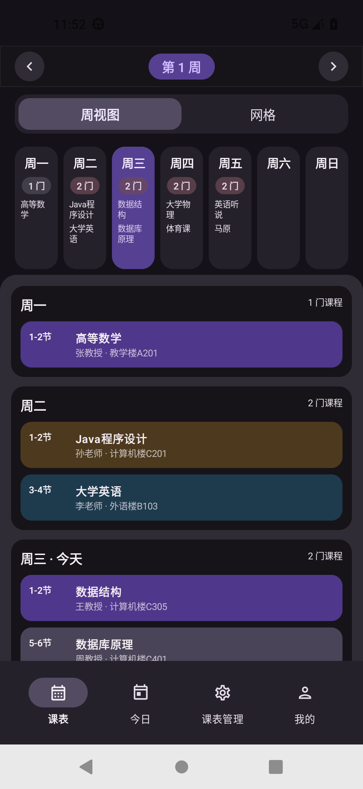
  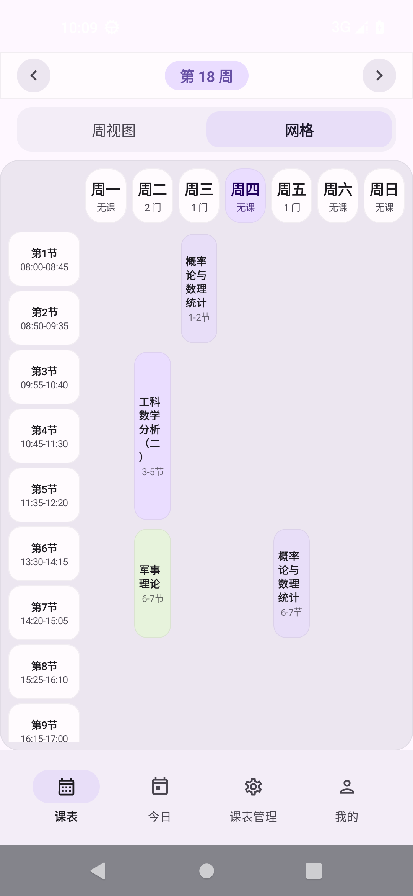
  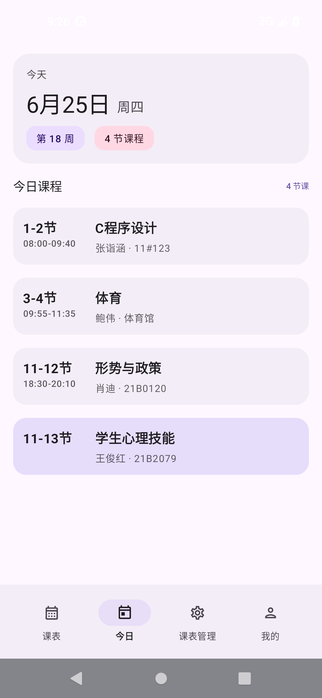
  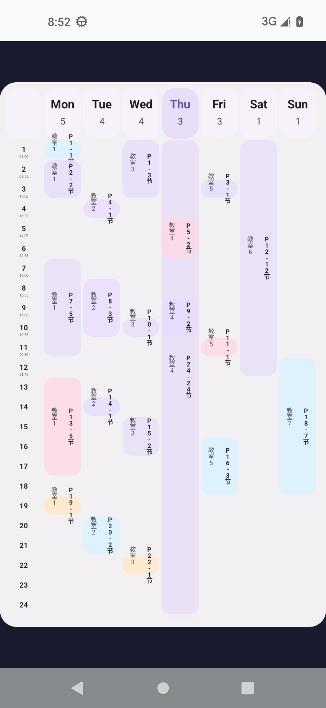
</p>

<p align="center">
  <code>v1.0.16</code> · Android 7.0+ · GPL-3.0
</p>

---

## 概要

| 项 | 值 |
|---|---|
| 包名 | `com.lingion.sleepy.debug` |
| 最低 SDK | 24 (Android 7.0) |
| 目标 SDK | 35 |
| 架构 | arm64-v8a / x86_64 |
| 语言 | zh-CN · zh-TW · en · ja · es |

Sleepy 乃 Android 课程表工具。主旨：**轻、快、准**。纯 Kotlin + Compose 构建，零壳依赖。支持教务直连导入、多格式解析、四类桌面 Widget、每日课程通知、深色模式，五种主题配色任选。

---

## 📚 多课表管理

| 能力 | 说明 |
|---|---|
| 多表并行 | 创建/切换/删除多张独立课表 |
| 表属性 | 名称、开学日期、最大周数、每节节数、节次时间表 |
| 快切 | 导航栏一键跳转，Mine 页面管理全部课表 |

<p align="center">
  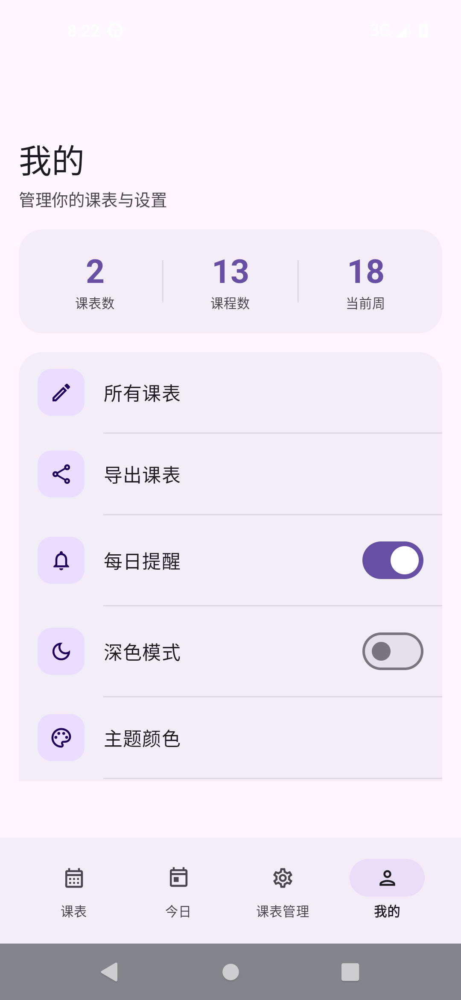
  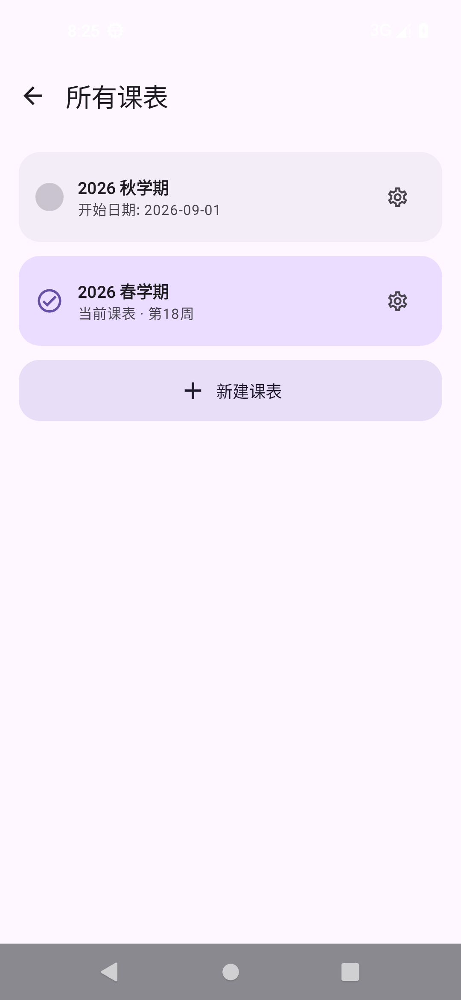
</p>

---

## ⏰ 节次配置 (SmartPeriodConfig)

v1.0.16 引入智能节次编辑，手动/自动双模式：

- **自动模式**：输入每节时长、总节数、首节时间、课间模板 → 自动推算全表时间
- **课间模板**：定义大/小课间分钟数，按 transition 分配
- **手动模式**：逐节设置起止时间
- 二者互转，数据持久化于 TimeTableEntity

<p align="center">
  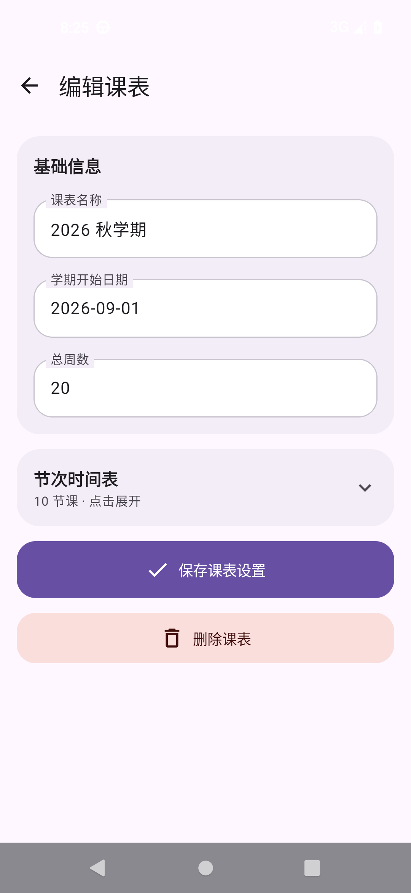
  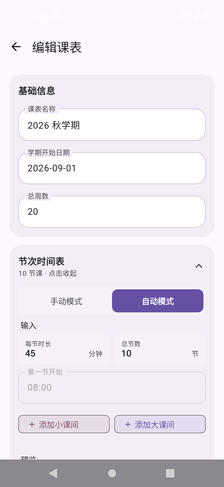
</p>

---

## 🖥 三视图

| 视图 | 说明 |
|---|---|
| **周视图** | 7 日横排 × N 节纵列，按当前周过滤，左右滑周 |
| **网格视图** | 经典时间网格，课程色块铺排，一目了然 |
| **今日视图** | 仅示当日课程，时间轴纵向排列 |

<p align="center">
  
  
  
</p>

---

## ✏️ 课程编辑

- `AddCourseScreen`：手动添加/编辑单条课程
- 字段：课名、教师、教室、备注、星期、起止节、起止周、单双周类型、课程色
- `CourseDetailSheet`：点击课程卡片弹出详情底部弹窗

<p align="center">
  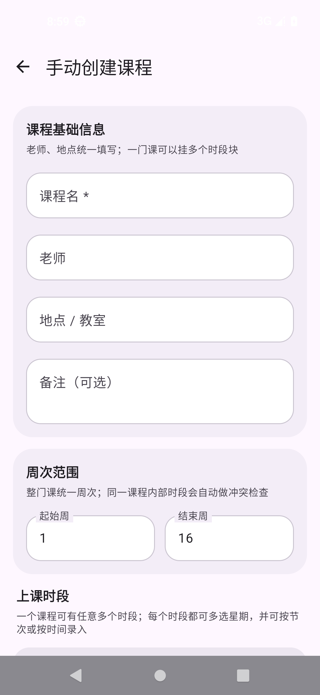
  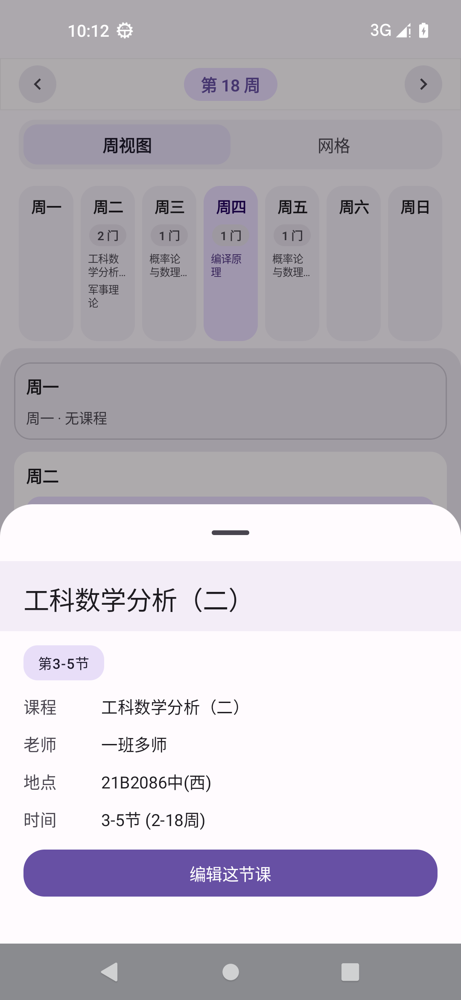
</p>

---

## 🎓 教务系统导入

WebView 登录 → 自动抓取课表。支持协议：

| 协议类型 | 说明 |
|---|---|
| `wisedu` | 金智教务（JSON API 直连，如哈尔滨工程大学） |
| `qz` / `qz_old` / `qz_crazy` / `qz_br` / `qz_with_node` | 强智教务（5 变体） |
| `zf` / `zf_1` / `zf_new` | 正方教务（3 变体） |
| `urp` / `urp_new` | URP 教务（2 变体） |
| `cf` | 青果教务 |
| `pku` | 北京大学 |
| `bnuz` | 北师珠 |

流程：选学校 → WebView 登录 → 解析 HTML → 自动填充。

<p align="center">
  
  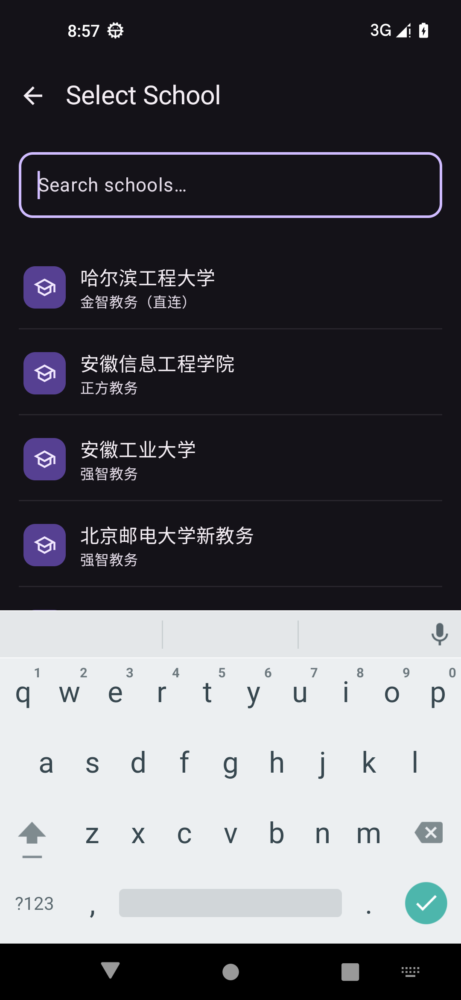
  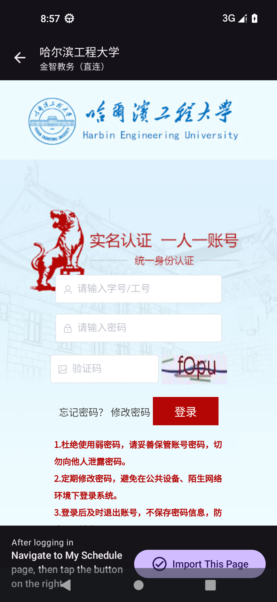
</p>

---

## 📂 多格式导入

`ScheduleParser` 自动识别格式，一行文本即可导入：

| 格式 | 识别方式 |
|---|---|
| WakeUp JSON | `{` + `"courseDetailJson"` / `"courses"` |
| ICS 日历 | `BEGIN:VCALENDAR` / `BEGIN:VEVENT` |
| CSV | 含表头行（课程名+教师+星期+节次+周次） |
| HTML 表格 | `<table>` 标签，自动抽取行列 |
| 纯文本 | Tab/空格分隔，一行一课 |

CSV 支持多区间周次（`2-5,7-9,11-14`）、离散周（`11,13,15`）、中英文列名混排。

<p align="center">
  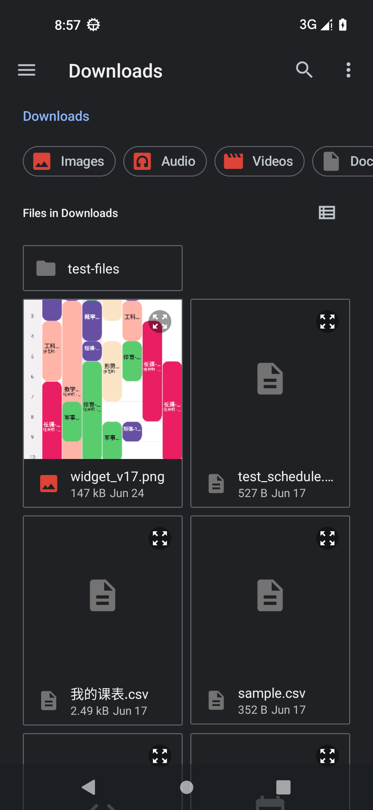
  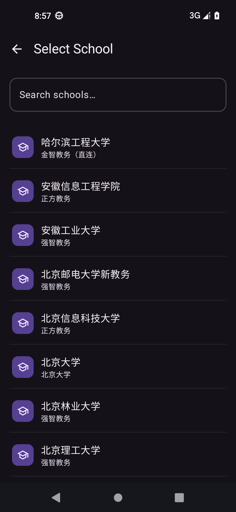
</p>

---

## 📤 导出

| 格式 | 用途 |
|---|---|
| WakeUp JSON | 兼容 WakeUp 课程表 app 导入 |
| 分享文本 | `courseDetailJson` URL 编码格式，可复制分享 |
| ICS 日历 | 导入系统日历 / Google Calendar / Apple Calendar |

<p align="center">
  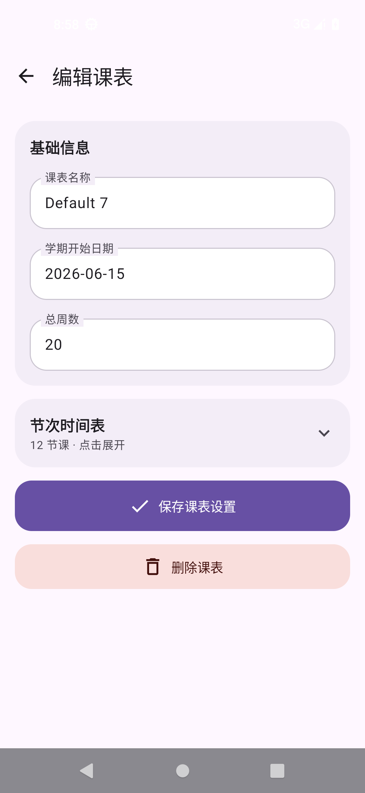
</p>

---

## 🧩 桌面 Widget (Glance)

四类 Widget，WorkManager 定时刷新：

| Widget | 说明 |
|---|---|
| **Today** | 今日课程列表 |
| **WeekList** | 本周课程周列表 |
| **TwoDay** | 今明两日课程 |
| **WeekGrid** | 本周课程网格视图 |

WeekGrid 截图（Canvas 直绘，24 节全显示）：

<p align="center">
  
</p>

其他三 Widget 用 Glance Composable 渲染，样式与 Today / Schedule 视图一致。

---

## 🔔 课程通知

`CourseNotificationScheduler` · 每日 07:00 推送今日课程提醒：

- AlarmManager 精确/非精确双路降级（Android 12+ 兼容）
- BootReceiver 重注册（开机/更新后自动恢复）
- DataStore 持久化开关状态

---

## 🌙 深色模式 & 主题

5 套预设 + 跟随系统：

| 主题 | 风格 |
|---|---|
| 默认淡紫 | Material 3 紫色调 |
| 春绿 | 抹茶植物 |
| 海蓝 | 沉静冷调 |
| 蜜桃粉 | 暖橙 |
| 石板灰 | 中性冷淡 |
| 跟随系统 | 自动适配 |

每套含 Light/Dark 完整配色方案，`ThemeColorScreen` 一键切换。

<p align="center">
  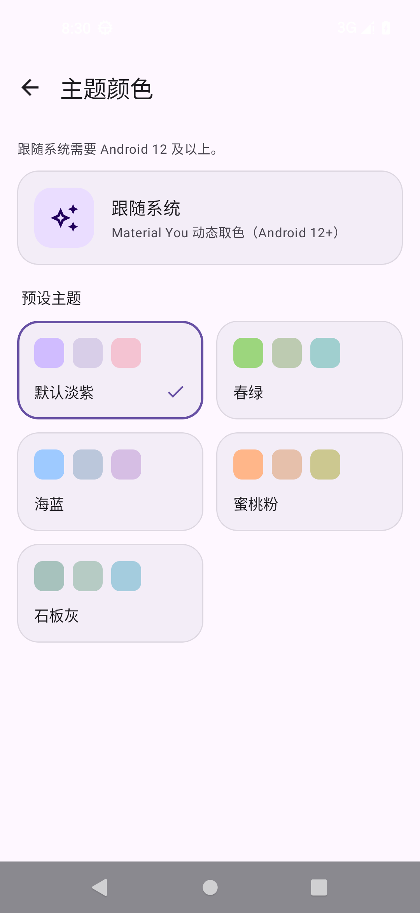
</p>

---

## 📋 课表管理总览

<p align="center">
  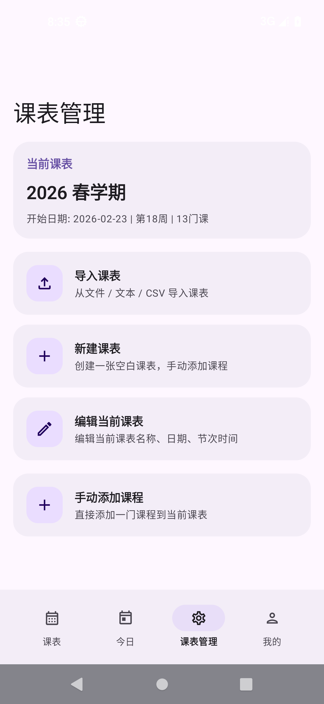
</p>

---

## 技术栈

```
language        = Kotlin 2.0.0
ui              = Jetpack Compose (BOM 2024.10.00) + Material 3
navigation      = Navigation Compose 2.8.3
storage         = Room 2.6.1 (KSP)
prefs           = DataStore Preferences 1.1.1
serialization   = kotlinx-serialization-json 1.6.3
html_parser     = jsoup 1.18.1
widgets         = Glance AppWidget 1.1.0
background      = WorkManager 2.9.1
image           = Coil Compose 2.7.0
splash          = Core Splash Screen 1.0.1
build           = AGP 8.5.2 + Gradle Kotlin DSL
java_compat     = 17
```

---

## 项目结构

```
sleepy/
├── app/src/main/
│   ├── java/com/lingion/sleepy/
│   │   ├── MainActivity.kt              # 单 Activity 入口
│   │   ├── SleepyApp.kt                # Application（DI、通知调度器）
│   │   ├── data/
│   │   │   ├── AppDatabase.kt          # Room 数据库
│   │   │   ├── dao/
│   │   │   │   ├── CourseDao.kt        # 课程 CRUD
│   │   │   │   └── TimeTableDao.kt     # 课表 CRUD
│   │   │   ├── entity/
│   │   │   │   ├── CourseEntity.kt     # 课程数据实体
│   │   │   │   ├── SmartPeriodConfig.kt # 智能节次配置
│   │   │   │   └── TimeTableEntity.kt   # 课表数据实体
│   │   │   ├── jw/                     # 教务系统导入
│   │   │   │   ├── JwSchoolInfo.kt      # 学校元数据
│   │   │   │   ├── JwProtocol.kt        # 协议类型枚举
│   │   │   │   ├── JwParser.kt          # 解析入口
│   │   │   │   ├── JwWiseduParser.kt    # 金智 Wisedu 解析
│   │   │   │   ├── JwQzParser.kt        # 强智解析
│   │   │   │   ├── JwQzCrazyParser.kt   # 强智 Crazy 变体
│   │   │   │   ├── JwUrpParser.kt       # URP 解析
│   │   │   │   ├── JwNewUrpParser.kt    # URP 新版
│   │   │   │   └── JwImportViewModel.kt # 导入状态管理
│   │   │   ├── parser/
│   │   │   │   ├── ScheduleParser.kt    # 多格式导入解析
│   │   │   │   └── ScheduleExporter.kt  # 导出（JSON/ICS/文本）
│   │   │   └── repository/
│   │   │       └── ScheduleRepository.kt # 数据聚合层
│   │   ├── ui/
│   │   │   ├── component/               # 通用 UI 组件
│   │   │   │   ├── CourseTableView.kt   # 课程表格视图
│   │   │   │   ├── CourseDetailSheet.kt # 课程详情弹窗
│   │   │   │   ├── SmartPeriodEditor.kt # 智能节次编辑器
│   │   │   │   ├── TimeSlotEditor.kt    # 节次时间编辑
│   │   │   │   ├── PillNavigationBar.kt # 底部导航栏
│   │   │   │   ├── SegmentedSwitcher.kt # 分段切换器
│   │   │   │   └── DateTimePickers.kt    # 日期时间选择器
│   │   │   ├── screen/
│   │   │   │   ├── schedule/            # 周视图 + 网格视图
│   │   │   │   ├── today/               # 今日视图
│   │   │   │   ├── edit/                # 课程编辑
│   │   │   │   ├── imports/             # 教务导入 + 文本导入 + 学校选择
│   │   │   │   ├── manage/              # 课程管理
│   │   │   │   └── mine/                # 我的（课表管理/主题/设置）
│   │   │   └── theme/
│   │   │       ├── Theme.kt             # 主题切换逻辑
│   │   │       └── ThemePresets.kt      # 5 套配色方案
│   │   ├── util/
│   │   │   ├── AppPrefs.kt             # DataStore 偏好
│   │   │   ├── DateUtils.kt            # 日期工具
│   │   │   ├── LocaleHelper.kt         # 多语言
│   │   │   └── TimeTableUtils.kt       # 课表工具
│   │   └── widget/
│   │       ├── TodayWidget.kt           # 今日 Widget
│   │       ├── WeekListWidget.kt        # 周列表 Widget
│   │       ├── TwoDayWidget.kt         # 今明 Widget
│   │       ├── WeekGridWidget.kt       # 网格 Widget (Canvas bitmap)
│   │       ├── WeekGridWidgetProvider.kt # 网格 Widget 渲染
│   │       ├── WidgetContent.kt        # Widget 内容渲染 (Glance)
│   │       ├── WidgetRenderActivity.kt # Widget 渲染预览
│   │       ├── WidgetTableResolver.kt  # Widget 课表解析
│   │       ├── WidgetUpdateWorker.kt   # WorkManager 刷新
│   │       ├── WidgetUpdater.kt        # 更新调度
│   │       └── notification/
│   │           └── CourseNotificationScheduler.kt # 每日通知
│   └── res/
│       ├── values/                      # 默认资源 (zh-CN)
│       ├── values-zh-rCN/
│       ├── values-zh-rTW/
│       ├── values-en/
│       ├── values-ja/
│       ├── values-es/
│       └── xml/                        # Widget 配置
├── app/src/test/                        # JVM 单测
├── docs/
│   └── screenshots/                     # 应用截图
├── build.gradle.kts                     # 根构建配置
├── app/build.gradle.kts                 # App 模块配置
├── settings.gradle.kts                  # 仓库镜像（阿里云）
├── gradle.properties
└── LICENSE                              # GPL-3.0
```

---

## 构建 & 安装

### 前置

```bash
# JDK 17+
java -version

# Android SDK compileSdk=35
sdkmanager "platforms;android-35" "build-tools;35.0.0"
```

### 编译

```bash
git clone https://github.com/lingion/sleepy.git
cd sleepy

# Debug（x86_64 模拟器 / arm64 真机）
./gradlew assembleDebug

# Release
./gradlew assembleRelease
```

产物位于 `app/build/outputs/apk/debug/` 或 `release/`。

### 安装

```bash
adb install app/build/outputs/apk/debug/*.apk
```

> ABI 分包：arm64-v8a（真机）、x86_64（模拟器）。自动匹配设备架构。

---

## License

[GPL-3.0](LICENSE)

---

<p align="center">
  <sub>构建无壳，自由自在。</sub>
</p>