<p align="center">
  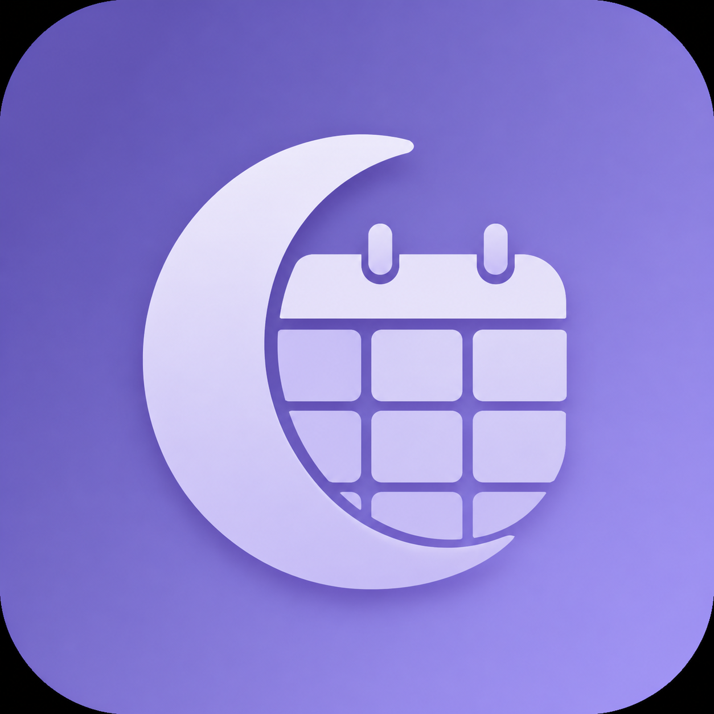
</p>

<h1 align="center">Sleepy · Lightweight Timetable</h1>

<p align="center">
  A clean, Material You Android schedule/timetable app built with Kotlin + Jetpack Compose.<br>
  Multi-view · Direct JW system import · Home-screen widgets · HSV custom colors
</p>

<p align="center">
  <a href="https://github.com/lingion/sleepy/releases"></a>
  
  
  
  
  
  
  
</p>

<p align="center">
  <a href="README.md">中文</a> · <a href="README_EN.md">English</a> · <a href="https://github.com/lingion/sleepy/releases">Download APK</a> · <a href="docs/adapt-kit/README.md">Add your university</a>
</p>

---

> **Keywords (SEO):** Android schedule app, timetable, university schedule, Jetpack Compose, Material You, Chinese university academic system import, wisedu, home screen widget, HSV color picker, open source timetable

---

## Screenshots

<p align="center">
  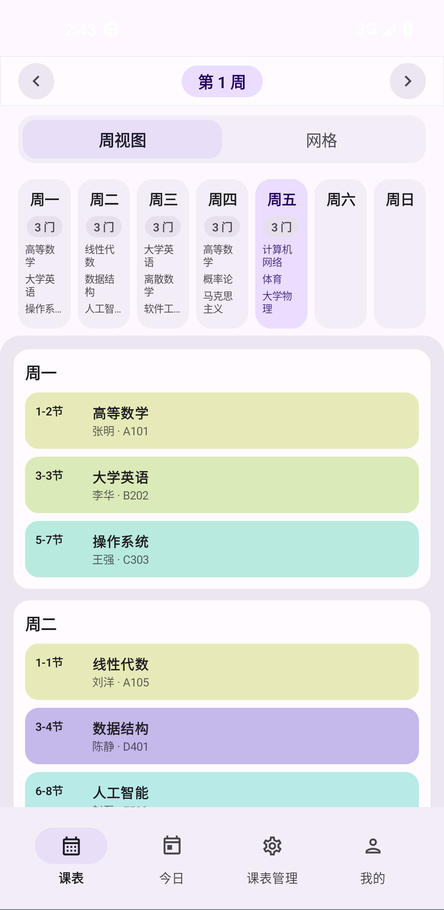
  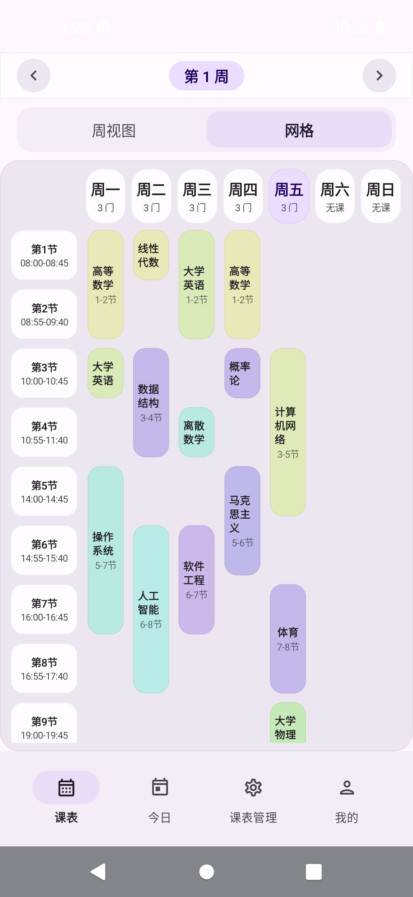
  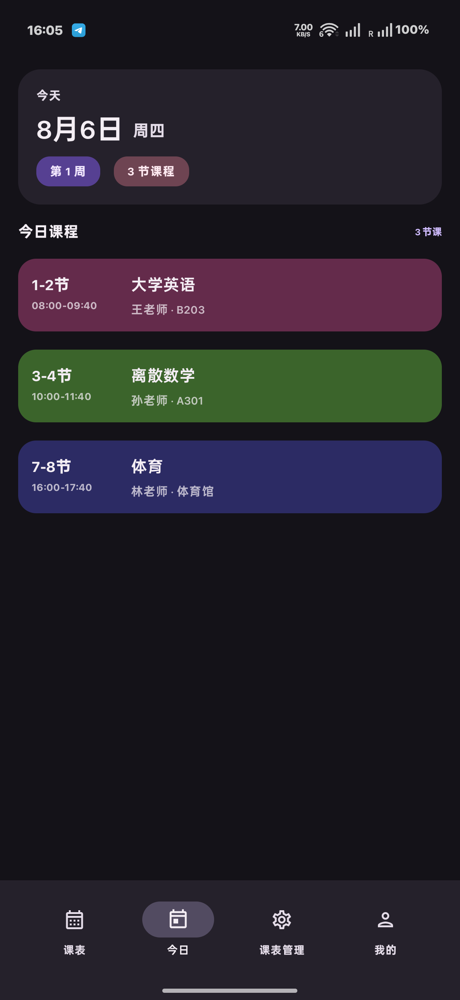
</p>
<p align="center">
  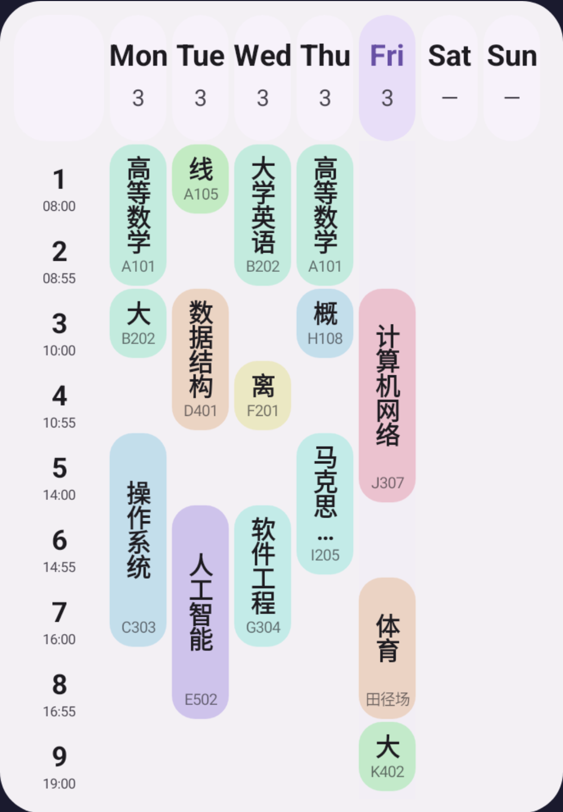
  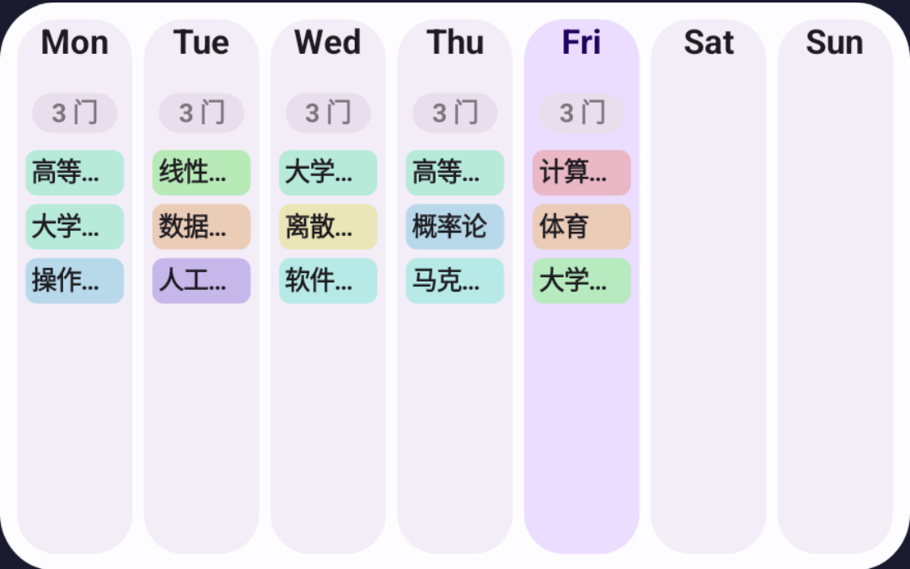
  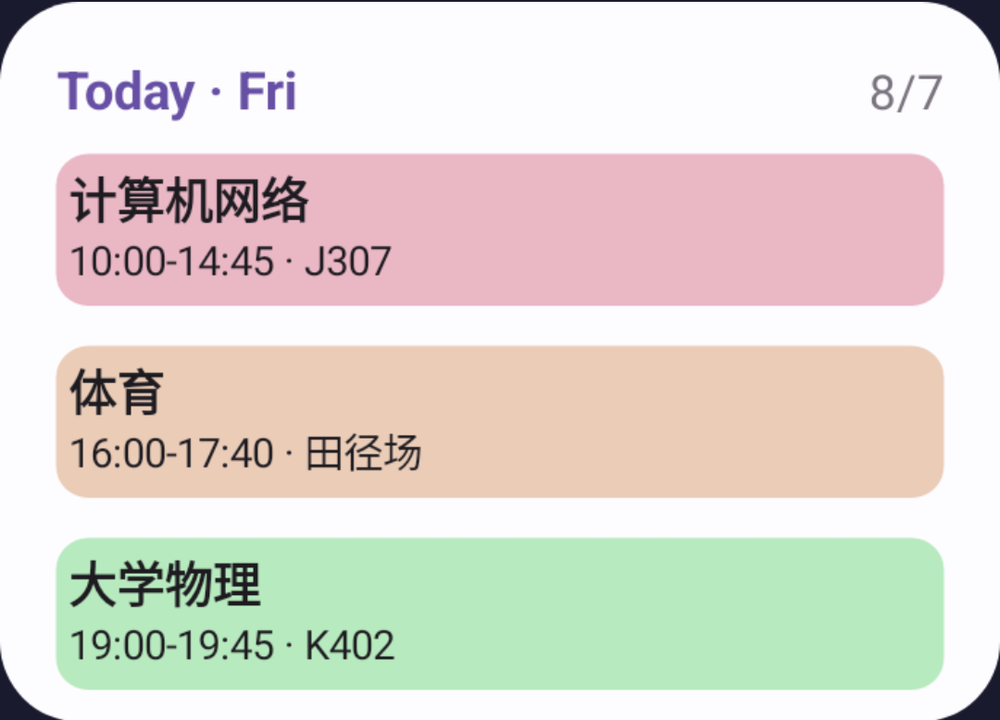
  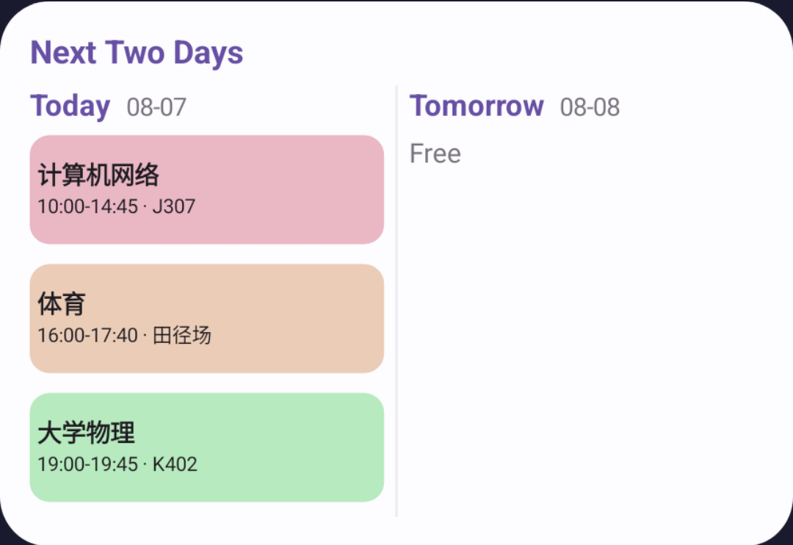
</p>
<p align="center">
  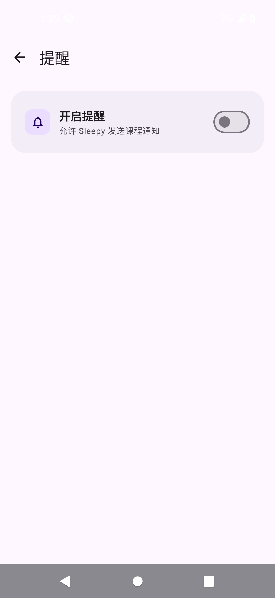
  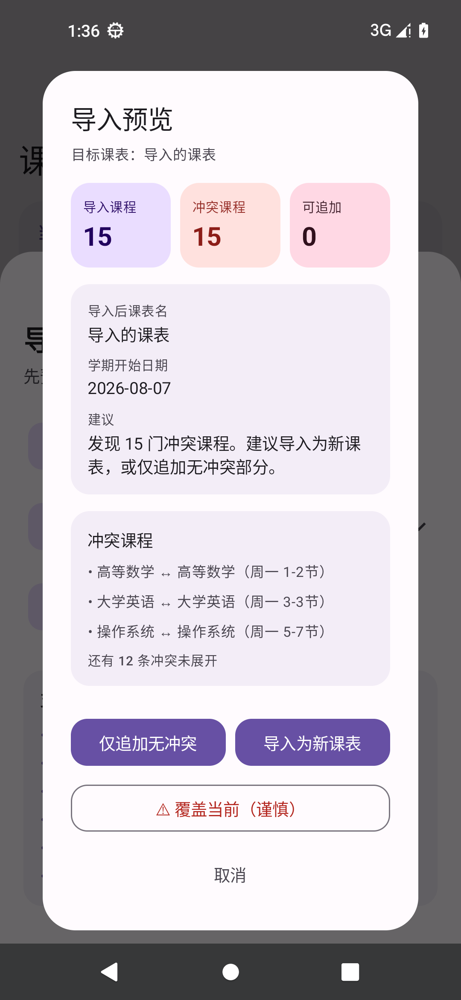
  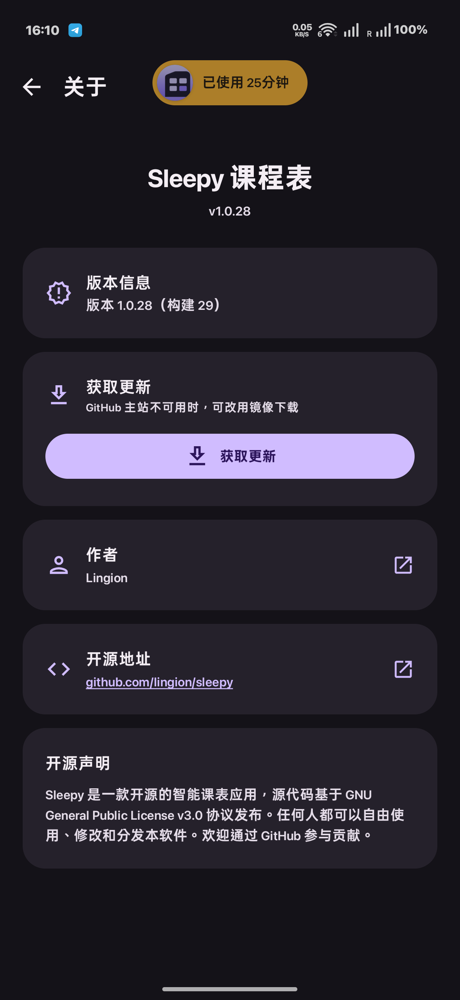
</p>

<p align="center">
  Android 8.0+ · Package <code>com.lingion.sleepy</code>
</p>

---

## Overview

| Item | Value |
|---|---|
| Package | `com.lingion.sleepy` |
| Min SDK | `26` (Android 8.0; required by OPPO SeedlingSupportSDK 3.0.7) |
| Target SDK | `37` |
| ABIs | arm64-v8a / armeabi-v7a / x86_64 |
| Languages | zh-CN · zh-TW · en · ja · es |

Sleepy is an Android timetable app built around three principles: **light, fast, accurate**. No shell dependencies. Direct import from university academic systems (JW), multi-format parsing, five home-screen widget types, daily course notifications, dark mode, and five theme presets.

---

## Three Views

The main screen has three views, switchable from the top bar.

| View | Screenshot |
|---|---|
| **Week view** (7 days × N periods) | <p align="left"></p> |
| **Grid view** (time grid · colored course blocks) | <p align="left"></p> |
| **Today view** ("Today" tab · today's courses) | <p align="left"></p> |

Features:
- Swipe left/right to change weeks, week number computed live
- Swipe works in both week and grid views (HorizontalPager)
- Courses filtered to the current week by week-range + odd/even + period-range
- Tap a course card for the detail bottom sheet

---

## Multiple Timetables

Manage several independent timetables, each with its own period times, start date, and max week count.

<p align="left">
  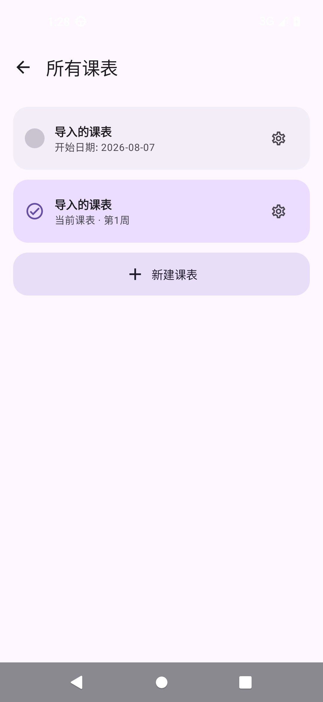
  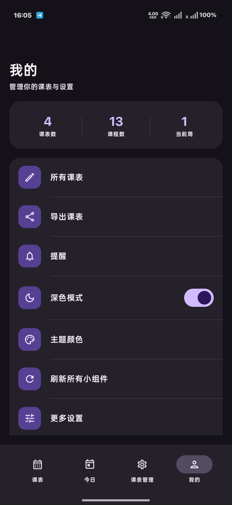
</p>

> Left: all timetables (gear icon to edit)
> Right: "Mine" page (stats + entries)

Creating or editing a timetable requires: name, start date, max weeks, period time table (manual or auto mode).

---

## Period Configuration (Manual / Auto)

Manual mode sets each period's start and end individually. Auto mode takes period length + total periods + first bell + break templates and derives everything else.

<p align="left">
  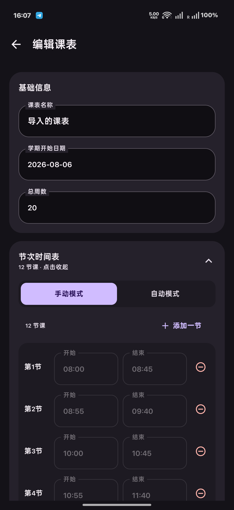
  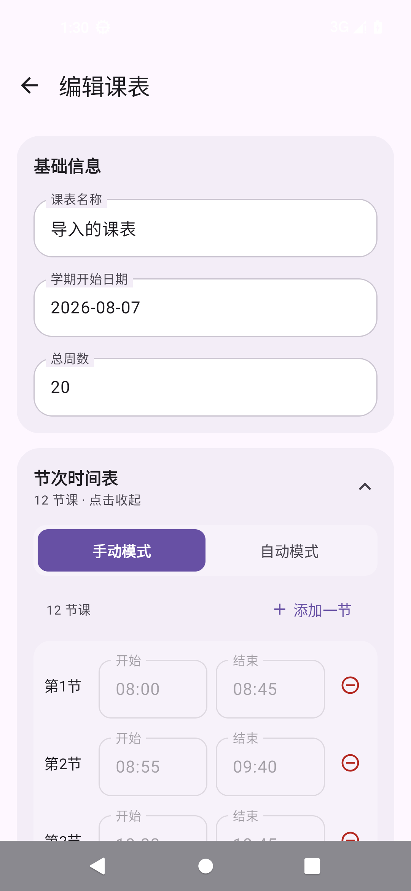
</p>

> Left: manual mode (12-period real-world HEU schedule expanded)
> Right: auto mode (period length / total / first bell / break templates / preview toggle)

Auto mode details:
- Cross-group exclusivity (the same transition can't be both a long and a short break)
- Zero-minute gaps are valid; adjacent periods need no break between them
- Card-grid multi-select with immediate visual feedback

---

## JW System Import

Entry: bottom bar "Timetables" → "Import". All three import paths **preview first, import second** — never overwriting an existing timetable.

<p align="left">
  
</p>

| Entry | Flow |
|---|---|
| **Direct JW import** | Pick your university → WebView login → automatic fetch → preview → import |
| **Paste text** | Paste any format → auto-detect → preview → import |
| **From file** | Pick `.json` / `.ics` / `.csv` / `.html` → preview → import |

### Supported JW Protocols

| Protocol | Notes |
|---|---|
| `wisedu` | Wisedu JW (JSON API direct; e.g. Harbin Engineering University) |
| `qz` / `qz_old` / `qz_crazy` / `qz_br` / `qz_with_node` | Qiangzhi JW (5 variants) |
| `zf` / `zf_1` / `zf_new` | Zhengfang JW (3 variants) |
| `urp` / `urp_new` | URP JW (2 variants) |
| `cf` | Qingguo JW |
| `classic_eams` | Classic Wisedu EAMS (UESTC, SUFE, Hunan Normal, NUAA, etc.) |
| `eams5` | supwisdom EAMS5 (HFUT, Anhui Univ., CUMT-Beijing) |
| `whut` | Wuhan University of Technology (Wisedu variant) |
| `pku` | Peking University |
| `bnuz` | BNU Zhuhai |

### University not listed?

Direct import is adapted per university (179 supported so far). Unadapted universities fail to import. **Collect a JW snapshot in 5 minutes and we'll add yours** — log into the JW system on a computer, paste a short script in the browser console, send us the output. Full guide: **[collection guide](docs/adapt-kit/README.md)** (Chinese — email lingion@hrbeu.edu.cn if you need it in English), or [open an adaptation request](https://github.com/lingion/sleepy/issues/new?template=school_adaptation.yml) directly.

### Supported Text Formats

| Format | Recognition |
|---|---|
| **WakeUp share text** | Starts with `【来自WakeUp课程表】` |
| **WakeUp JSON** | `.json` exported from Sleepy / WakeUp |
| **ICS calendar** | Standard iCalendar, often exportable from university systems |
| **CSV file** | `.csv` with header row, comma-separated |
| **HTML table** | `<table>` markup, parsed header-first |
| **Plain text** | One course per line, tab-separated |

---

## Course Editing

<p align="left">
  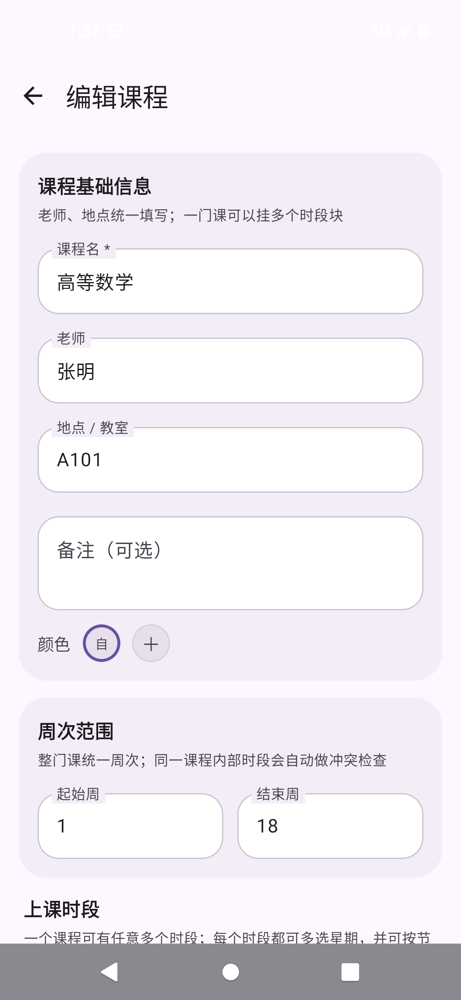
  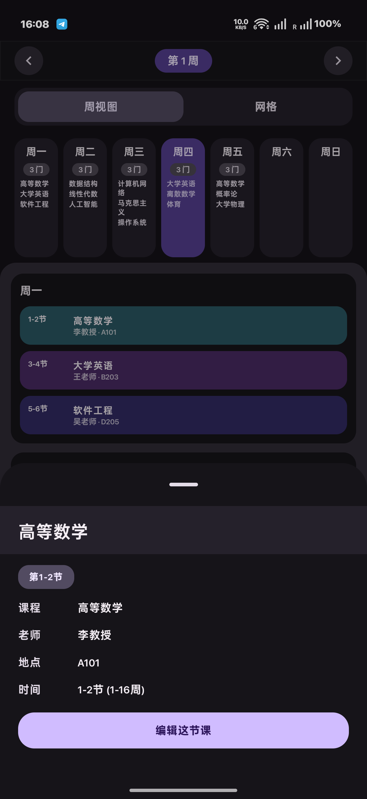
</p>

> Left: manually add/edit a single course
> Right: tapping a course card in week view opens the detail bottom sheet

Fields: course name · teacher · room · notes · weekday · period range · week range · odd/even type · course color.

---

## Export

Three export formats. Files are saved to the device's `Download/Sleepy/` and the system share sheet opens automatically.

<p align="left">
  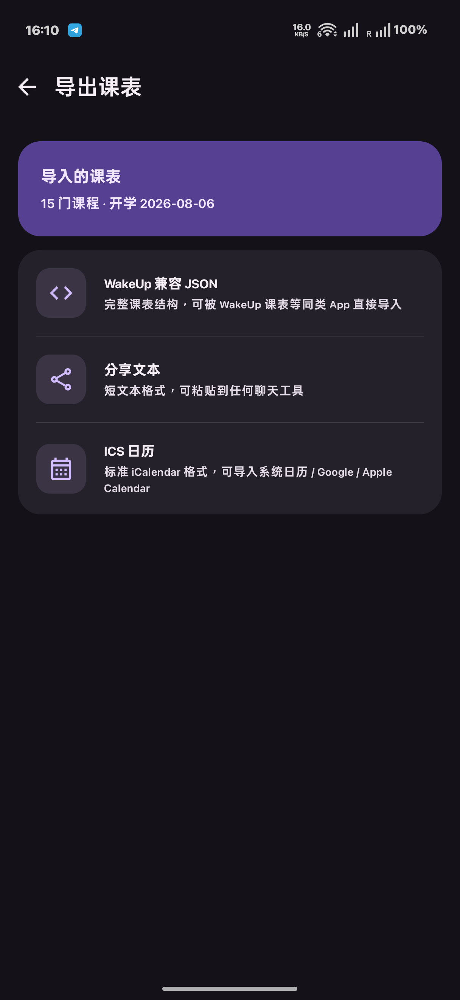
</p>

> Screenshot: export page ("Mine → Export")

| Format | Use | Implementation |
|---|---|---|
| **WakeUp-compatible JSON** | Full timetable structure; importable by WakeUp and similar apps | `ScheduleExporter.exportWakeUpJson` |
| **Share text** | Compact text format (URL-encoded JSON); paste anywhere | `ScheduleExporter.exportWakeUpShareText` |
| **ICS calendar** | Standard iCalendar; import into system / Google / Apple Calendar | `ScheduleExporter.exportIcs` |

File path: `Download/Sleepy/sleepy_<name>_<timestamp>.{json|ics}`.

---

## Home-screen Widgets (5 types)

Five widget types, refreshed by WorkManager. Layouts adapt to launcher sizing.

| Widget | Default size | Shows | Screenshot |
|---|---|---|---|
| **Today** | 4×3 cell (250×180dp) | Today's course list | <p align="left"></p> |
| **TwoDay** | 5×3 cell (320×220dp) | Today + tomorrow, two columns | <p align="left"></p> |
| **WeekList** | 5×4 cell (320×200dp) | 7-day course summary + names | <p align="left"></p> |
| **WeekView** | 5×4 cell (320×200dp) | Week-view thumbnail (theme-colored, no capsules) | no separate screenshot |
| **WeekGrid** | 4×5 cell (250×360dp) | Full time grid + course blocks | <p align="left"></p> |

Implementation notes:
- All five use synchronous RemoteViews + Canvas rendering (since v1.0.29). Heavily customized launchers like OPPO freeze Glance's async SessionWorker, leaving stale cards — hence the port.
- Colors sync with the app theme in real time (dark mode + 5 presets)
- **Three render paths (main app / WeekGrid / screenshot renderer) share identical color logic**: course colors are distributed by golden-angle (137.508°) HSL hue from a hash of the course group — evenly spread and stable per course
- Refresh: `APPWIDGET_UPDATE` broadcast to all 5 receivers (system-level) + WorkManager every 15 minutes

---

## OPPO Fluid Cloud

Since v1.0.37 the before-class reminder supports a Fluid Cloud style: `FluidCloudService` (foreground service) renders course name, time, and room via `NotificationCompat.ProgressStyle`, with a progress bar that advances toward class time, persistently visible in the status bar (off by default). OPPO/OnePlus Seedling card integration materials are ready but **not yet wired into the build**.

- OPPO `SeedlingSupportSDK-lite 3.0.7` AAR sits in `app/libs/` (minSdk 26); gradle does not yet declare the dependency; `SeedlingCardWidgetProvider` is unimplemented
- UPK source project in [`oppo-fluid-cloud-upk/`](oppo-fluid-cloud-upk/) (API 2.0, `immediate` trigger, `notification/statusbar` entry)
- OPPO-assigned values (`identifier`, `intent`, etc.) remain as `REPLACE_WITH_OPPO_*` placeholders — see that directory's README

---

## Notifications & Reminders

Entry: "Mine" → "Reminders". The master toggle is off by default; turning it on requests notification permission — a denial snaps it back off, and asking again works (not one-shot).

<p align="left">
  
</p>

| Feature | Trigger | Content (dynamically generated) |
|---|---|---|
| **Daily reminder** | User-set time each day | `Today the 15th: 3 classes. First class Calculus at 08:00 in Building A101` |
| **Before-class reminder** | N minutes before each class | `Next class Calculus at 08:00 in Building A101` |

- The minutes-before value is **free input** (1–999, capsule-style field, no hardcoded options)
- Reminder content **queries the day's timetable live**; on empty days it pushes "Today the Xth, no classes"
- Notifications go through `AlarmManager` exact/inexact dual-path fallback, Android 12+ compatible
- `BootReceiver` re-registers after reboot/app update
- Toggle state persists locally (`AppPrefs`, SharedPreferences)

---

## About

Entry: "Mine" → "About". A dedicated page showing version, author, and open-source info.

<p align="left">
  
</p>

| Section | Content |
|---|---|
| **Version** | Version + build number (`BuildConfig.VERSION_NAME` / `VERSION_CODE`) |
| **Author** | Lingion, tap to open the GitHub profile |
| **Source** | github.com/lingion/sleepy, tappable |
| **License note** | GPL-3.0 summary; contributions welcome |

---

## Dark Mode & Themes

5 presets + follow-system, each with a complete Light/Dark scheme. Switch in "Mine" → "Appearance".

<p align="left">
  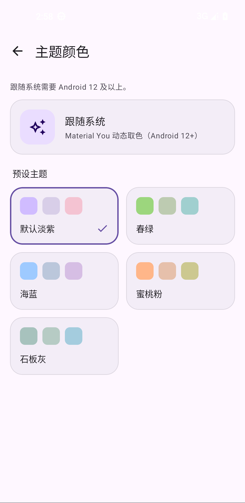
</p>

| Theme | Feel |
|---|---|
| Default lavender | Material 3 purple |
| Spring green | Matcha |
| Ocean blue | Calm cool tones |
| Peach pink | Warm orange |
| Slate gray | Neutral |
| Follow system | Auto |

---

## Timetable Management

<p align="left">
  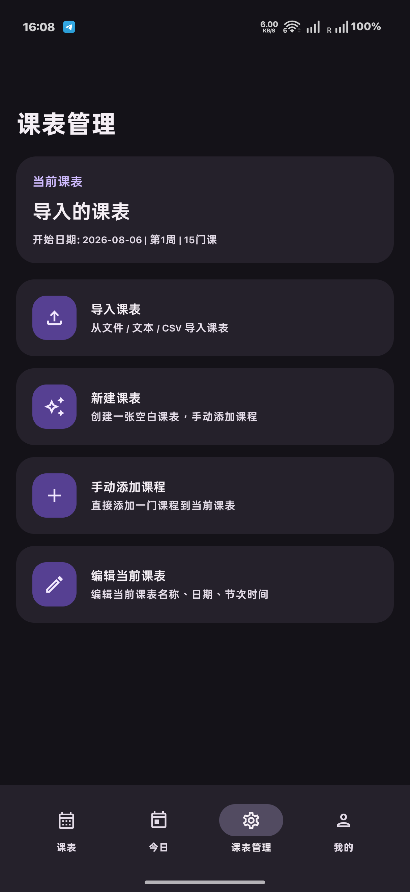
</p>

---

## Tech Stack

```
language        = Kotlin 2.1.10
ui              = Jetpack Compose (BOM 2024.10.00) + Material 3
navigation      = Navigation Compose 2.8.3
storage         = Room 2.7.0 (KSP)
prefs           = SharedPreferences (AppPrefs); DataStore 1.1.1 declared, unused
serialization   = kotlinx-serialization-json 1.6.3
html_parser     = jsoup 1.18.1
widgets         = RemoteViews + Canvas (synchronous; Glance removed)
background      = WorkManager 2.9.1
image           = Coil Compose 2.7.0
splash          = Core Splash Screen 1.0.1
core_ktx        = AndroidX Core 1.17.0
build           = AGP 9.1.0 + Gradle 9.3.1 (Kotlin DSL)
java_compat     = 17
```

---

## Project Structure

```
sleepy/
├── app/src/main/
│   ├── java/com/lingion/sleepy/
│   │   ├── MainActivity.kt              # Single-activity entry
│   │   ├── SleepyApp.kt                # Application (DI, notification scheduler)
│   │   ├── data/
│   │   │   ├── AppDatabase.kt          # Room database
│   │   │   ├── dao/                    # Course / Timetable DAOs
│   │   │   ├── entity/                 # Course / TimeTable / SmartPeriodConfig
│   │   │   ├── jw/                     # JW import (wisedu/qz/zf/urp/cf/pku/bnuz)
│   │   │   ├── parser/                 # ScheduleParser + ScheduleExporter
│   │   │   └── repository/             # ScheduleRepository
│   │   ├── ui/
│   │   │   ├── component/              # CourseTableView / CourseDetailSheet /
│   │   │   │                           # SmartPeriodEditor / TimeSlotEditor /
│   │   │   │                           # PillNavigationBar / SegmentedSwitcher
│   │   │   ├── screen/
│   │   │   │   ├── schedule/           # Week view + grid view
│   │   │   │   ├── today/              # Today view
│   │   │   │   ├── edit/               # Course editing
│   │   │   │   ├── imports/            # JW import + text import + school picker
│   │   │   │   ├── manage/             # Course management
│   │   │   │   └── mine/               # Mine / all timetables / edit / theme / export
│   │   │   └── theme/                  # Theme + ThemePresets (5 presets)
│   │   ├── util/                       # AppPrefs / DateUtils / LocaleHelper / TimeTableUtils
│   │   └── widget/                     # 5 widget types + WidgetRenderActivity + ScrollStripService
│   └── res/
│       ├── values/                     # Default resources (zh-CN)
│       ├── values-zh-rCN/              # Chinese simplified
│       ├── values-zh-rTW/              # Chinese traditional
│       ├── values-en/                  # English
│       ├── values-ja/                  # Japanese
│       ├── values-es/                  # Spanish
│       └── xml/                        # 5 widget configs + network/backup rules
├── docs/screenshots/                   # README screenshots
├── assets/                             # Logo source archive
├── build.gradle.kts                     # Root build
├── app/build.gradle.kts                 # App module
├── settings.gradle.kts
├── gradle.properties
└── LICENSE                              # GPL-3.0
```

---

## Build & Install

### Prerequisites

```bash
java -version           # JDK 17+

sdkmanager "platforms;android-37" "build-tools;37.0.0"
```

### Build

Linux / macOS:

```bash
git clone https://github.com/lingion/sleepy.git
cd sleepy

# Debug (x86_64 emulator / arm64 device), ~20MB
./gradlew assembleDebug
```

Native Windows (PowerShell / CMD; no WSL or Git Bash required):

1. Install JDK 17 or 21. Set `JAVA_HOME` to the JDK root directory (not `bin`), or add the JDK's `bin` directory to `PATH`.
2. Install Android SDK Platform 37 and the required Build Tools using Android Studio's SDK Manager or the command-line tools. Set `ANDROID_HOME` to the SDK root directory, or add `sdk.dir=C:/Users/your-name/AppData/Local/Android/Sdk` to `local.properties` in the project root (use forward slashes and your actual SDK path; this file is ignored by Git).
3. Run these commands from the project root:

```powershell
java -version
.\gradlew.bat --version
.\gradlew.bat assembleDebug
# Optional: run unit tests or remove build outputs
.\gradlew.bat testDebugUnitTest
.\gradlew.bat clean
```

The wrapper downloads the Gradle version specified in `gradle/wrapper/gradle-wrapper.properties`, so a separate Gradle installation is unnecessary. The first build requires internet access to download Gradle and dependencies. Debug APKs are written to `app/build/outputs/apk/debug/`.

### Install

```bash
adb install app/build/outputs/apk/debug/app-arm64-v8a-debug.apk
# or x86_64 emulator
adb install app/build/outputs/apk/debug/app-x86_64-debug.apk
```

> ABI splits: arm64-v8a (mainstream devices), armeabi-v7a (32-bit legacy), x86_64 (emulators). Installed automatically per device.

---

## Documentation

- **[Operation Guide](https://blog.qdp.qzz.io/docs/sleepy/overview)** — step-by-step user manual covering installation, import, widgets, themes, and troubleshooting
- **[Technical Write-up](https://blog.qdp.qzz.io/sleepy-material-you-schedule)** — architecture deep-dive: schedule parser engine, gold-angle HSL, Wisedu reverse-engineering, widget rendering pipeline

---

## License

[GPL-3.0](LICENSE)

Parts of the JW import adapters reference the public interfaces/parsing logic of these open-source projects, with thanks:

- [dIT8Zv/WakeupSchedule_BUPT](https://github.com/dIT8Zv/WakeupSchedule_BUPT)（Apache-2.0）— Zhengfang/Qiangzhi/URP parser structure
- 时光课程表重庆大学适配器（cqu.js，by 茵符草）— my.cqu.edu.cn REST API shape

---

<p align="center">
  <sub>No shell. No bloat. Just a timetable.</sub>
</p>
