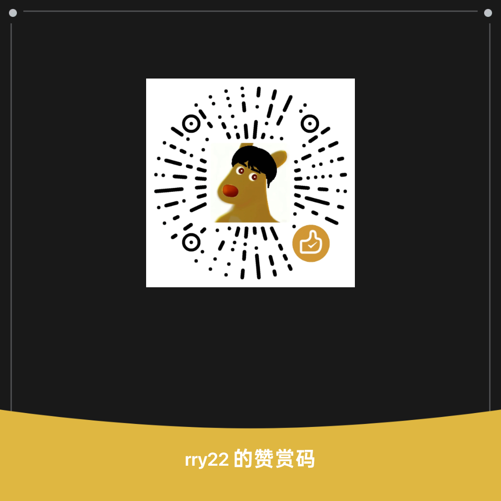

Sleepy 原本只是一个课程表。

后来它有了更多的学校，更多的人，更多并不认识我的人，在某一天打开它，发现自己的课终于出现在了屏幕上。

于是有人问我：什么时候有 iOS？

我想，这个问题并不难回答。

会有。

不是因为有人出了钱，也不是因为没有钱就不能做。一个人既然决定做一件事情，就应当承认这件事情首先是自己的责任，而不是把它交给陌生人来承担。

所以我会继续做。

Android 会继续维护。iOS 也会做。以后 Android 有了新的功能，我会把它带到 iOS；两边完成之后，一起发布新的版本。不会让其中一个成为另一个的影子，也不会让 iOS 成为一个被遗忘在仓库角落里的名字。

只是现实有时比代码更不讲道理。

发布 iOS 应用需要开发者账号，需要 Mac，需要一些并不产生任何新功能、却一分钱也省不下来的东西。钱不能替我写代码，却能使有些事情不必再等待。

因此，如果你愿意，可以赞助 Sleepy。

第一笔钱会用于 Apple Developer Program，每年 99 美元；之后是一台二手 Mac，闲鱼上 16G 内存的 MacBook Air M1，最低三千五百块。再往后，如果还有剩余，它会进入这个项目本身：在线体验站的服务器、开发工具、测试设备、模型额度，以及那些让一个开源项目继续向前走所需要的东西。

这些钱并不购买任何功能。

Sleepy 也不会因为谁没有赞助，就少给他一节课。

你不欠我什么。

我也不会把一个软件能不能继续做下去，写成别人必须替我完成的义务。

我会自己继续攒钱，继续写代码，继续维护它。

如果你愿意给它一点帮助，那么事情也许会快一些。

仅此而已。

至于为什么要感谢——

因为一个人原本可以把钱留在自己手里，却决定把它交给一个陌生人的项目。这件事没有任何义务可言，所以才值得感谢。

Sleepy 会继续存在。

有人同行，自然很好。

无人同行，也不过是我继续写下去罢了。

---

## 赞助 Sleepy

  
  

